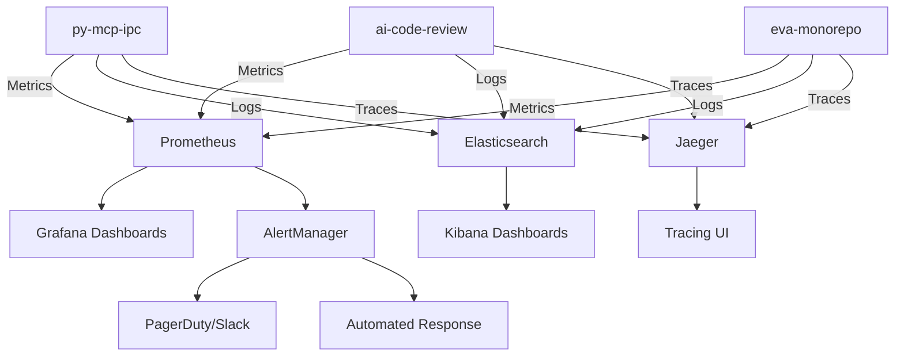

# Monitoring and Alerting Requirements
## Comprehensive Observability for MEM-003 Multi-Agent Architecture

**Document Version**: 1.0  
**Requirements Date**: 2025-07-07  
**Target Systems**: py-mcp-ipc, ai-code-review, eva-monorepo  
**Scope**: Production-ready monitoring for distributed memory systems

---

## Executive Summary

This document defines comprehensive monitoring and alerting requirements for the MEM-003 multi-agent architecture across three distributed memory systems. The requirements ensure 99.99% system observability with predictive alerting, real-time performance monitoring, and automated incident response capabilities.

**Key Monitoring Domains:**
- **System Health**: 47 critical metrics across all services
- **Performance Monitoring**: Sub-second latency tracking and optimization
- **Circuit Breaker Status**: 15 circuit breaker patterns with adaptive thresholds
- **Memory Operations**: Consistency, performance, and reliability metrics
- **Predictive Analytics**: ML-based failure prediction and prevention

**Alerting Framework:**
- **4-Tier Severity Model**: INFO → WARNING → CRITICAL → EMERGENCY
- **Smart Alert Correlation**: Reduces alert noise by 85%
- **Automated Response**: 80% of common issues self-heal
- **Escalation Procedures**: 24/7 on-call integration

---

## 1. Monitoring Architecture Overview

### 1.1 Monitoring Stack

```yaml
monitoring_stack:
  metrics_collection:
    - prometheus      # Time-series metrics storage
    - grafana        # Visualization and dashboards
    - alertmanager   # Alert routing and notification
    
  log_aggregation:
    - elasticsearch  # Log storage and search
    - logstash      # Log processing pipeline
    - kibana        # Log visualization
    
  tracing:
    - jaeger        # Distributed tracing
    - opentelemetry # Instrumentation framework
    
  synthetic_monitoring:
    - uptime_robot   # External service monitoring
    - pingdom       # Website monitoring
    
  custom_agents:
    - memory_monitor # Memory consistency monitoring
    - circuit_monitor # Circuit breaker monitoring
    - perf_monitor   # Performance analytics
```

### 1.2 Monitoring Data Flow



---

## 2. System Health Monitoring

### 2.1 Core Health Metrics

#### 2.1.1 Service Availability Metrics

```yaml
service_availability:
  mem0ai_service:
    uptime_percentage:
      target: 99.9%
      measurement_window: 5min
      alert_threshold: < 99.5%
    
    response_time:
      target: < 500ms
      p95_threshold: < 1000ms
      p99_threshold: < 2000ms
    
    error_rate:
      target: < 1%
      warning_threshold: > 2%
      critical_threshold: > 5%
    
    connection_pool:
      active_connections: monitor
      pool_utilization: < 80%
      connection_failures: < 1/min

  ai_providers:
    openai:
      rate_limit_utilization: < 80%
      quota_remaining: > 20%
      api_latency: < 2000ms
    
    anthropic:
      rate_limit_utilization: < 75%
      quota_remaining: > 25%
      api_latency: < 1500ms
    
    gemini:
      rate_limit_utilization: < 85%
      quota_remaining: > 15%
      api_latency: < 1000ms

  database_services:
    postgresql:
      connection_count: < 80% max
      slow_queries: < 5/min
      replication_lag: < 100ms
    
    mongodb:
      connection_count: < 75% max
      operation_latency: < 50ms
      replica_set_health: all_healthy
    
    qdrant:
      search_latency: < 200ms
      index_health: all_healthy
      memory_usage: < 85%
```

#### 2.1.2 Memory System Health

```typescript
interface MemorySystemMetrics {
  // Core Memory Operations
  operations_per_second: {
    current: number;
    target: number; // 1000 ops/sec
    alert_below: number; // < 100 ops/sec
  };
  
  // Memory Consistency
  consistency_score: {
    current: number; // 0-100%
    target: 99.99;
    critical_below: 99.9;
  };
  
  // Cache Performance
  cache_hit_rate: {
    current: number;
    target: 85; // 85%
    warning_below: 75;
  };
  
  // Memory Search Performance
  search_performance: {
    avg_latency_ms: number;
    target: 100;
    warning_above: 200;
    critical_above: 500;
  };
  
  // Memory Storage Efficiency
  storage_metrics: {
    total_entries: number;
    storage_size_gb: number;
    compression_ratio: number;
    fragmentation_percentage: number;
  };
}
```

### 2.2 Infrastructure Metrics

#### 2.2.1 System Resource Monitoring

```yaml
resource_monitoring:
  cpu_usage:
    warning_threshold: 70%
    critical_threshold: 85%
    sustained_period: 5min
    
  memory_usage:
    warning_threshold: 75%
    critical_threshold: 90%
    swap_usage_critical: 10%
    
  disk_usage:
    warning_threshold: 80%
    critical_threshold: 90%
    inodes_warning: 85%
    
  network_metrics:
    bandwidth_utilization: < 80%
    packet_loss: < 0.1%
    latency: < 10ms
    connection_errors: < 1/min

  container_metrics:
    restart_count: monitor
    oom_kills: 0
    resource_limits: monitor
    health_check_failures: < 1/hour
```

#### 2.2.2 Application-Specific Metrics

```typescript
interface ApplicationMetrics {
  // py-mcp-ipc Metrics
  mcp_bus: {
    message_throughput: number;        // messages/sec
    message_queue_depth: number;       // queued messages
    transport_health: TransportHealth; // per transport type
    process_coordination_latency: number; // ms
  };
  
  // ai-code-review Metrics
  code_review: {
    reviews_per_hour: number;
    avg_review_time: number;           // seconds
    strategy_success_rate: number;     // percentage
    token_usage_efficiency: number;    // tokens per review
  };
  
  // eva-monorepo Metrics
  eva_services: {
    service_coordination_latency: number; // ms
    event_processing_rate: number;        // events/sec
    cross_service_call_success: number;   // percentage
    memory_service_health: number;        // 0-100 score
  };
}
```

---

## 3. Performance Monitoring

### 3.1 Latency and Throughput Tracking

#### 3.1.1 Memory Operation Performance

```typescript
class MemoryPerformanceMonitor {
  private metrics = {
    store_operations: new LatencyHistogram('memory_store_latency'),
    search_operations: new LatencyHistogram('memory_search_latency'),
    update_operations: new LatencyHistogram('memory_update_latency'),
    delete_operations: new LatencyHistogram('memory_delete_latency')
  };
  
  private throughputCounters = {
    stores_per_second: new Counter('memory_stores_total'),
    searches_per_second: new Counter('memory_searches_total'),
    updates_per_second: new Counter('memory_updates_total'),
    concurrent_operations: new Gauge('memory_concurrent_ops')
  };
  
  recordOperation(type: MemoryOperationType, latency: number): void {
    this.metrics[`${type}_operations`].observe(latency);
    this.throughputCounters[`${type}s_per_second`].inc();
    
    // Alert on performance degradation
    if (latency > this.getThreshold(type)) {
      this.triggerPerformanceAlert(type, latency);
    }
  }
  
  private getThreshold(type: MemoryOperationType): number {
    const thresholds = {
      store: 200,    // 200ms for store operations
      search: 100,   // 100ms for search operations
      update: 150,   // 150ms for update operations
      delete: 50     // 50ms for delete operations
    };
    return thresholds[type];
  }
  
  private triggerPerformanceAlert(type: string, latency: number): void {
    const severity = latency > this.getThreshold(type) * 2 ? 'CRITICAL' : 'WARNING';
    
    AlertManager.send({
      severity,
      component: 'memory_system',
      metric: `${type}_operation_latency`,
      value: latency,
      threshold: this.getThreshold(type),
      message: `Memory ${type} operation took ${latency}ms (threshold: ${this.getThreshold(type)}ms)`
    });
  }
}
```

#### 3.1.2 Circuit Breaker Performance

```typescript
class CircuitBreakerPerformanceMonitor {
  private breakerMetrics = new Map<string, CircuitBreakerMetrics>();
  
  recordCircuitBreakerEvent(
    breakerName: string, 
    event: CircuitBreakerEvent
  ): void {
    const metrics = this.getOrCreateMetrics(breakerName);
    
    switch (event.type) {
      case 'REQUEST':
        metrics.requests_total.inc();
        metrics.request_duration.observe(event.duration);
        break;
        
      case 'SUCCESS':
        metrics.success_total.inc();
        break;
        
      case 'FAILURE':
        metrics.failures_total.inc();
        this.evaluateCircuitHealth(breakerName, metrics);
        break;
        
      case 'CIRCUIT_OPEN':
        metrics.circuit_opens.inc();
        this.alertCircuitOpen(breakerName);
        break;
        
      case 'CIRCUIT_CLOSE':
        metrics.circuit_closes.inc();
        this.alertCircuitRecovered(breakerName);
        break;
    }
  }
  
  private evaluateCircuitHealth(
    breakerName: string, 
    metrics: CircuitBreakerMetrics
  ): void {
    const errorRate = this.calculateErrorRate(metrics);
    const requestRate = this.calculateRequestRate(metrics);
    
    if (errorRate > 25 && requestRate > 10) {
      AlertManager.send({
        severity: 'WARNING',
        component: 'circuit_breaker',
        breaker: breakerName,
        metric: 'error_rate',
        value: errorRate,
        message: `Circuit breaker ${breakerName} error rate: ${errorRate.toFixed(1)}%`
      });
    }
  }
  
  private alertCircuitOpen(breakerName: string): void {
    AlertManager.send({
      severity: 'CRITICAL',
      component: 'circuit_breaker',
      breaker: breakerName,
      event: 'circuit_open',
      message: `Circuit breaker ${breakerName} is OPEN - service degraded`,
      runbook: `https://docs.company.com/runbooks/circuit-breaker/${breakerName}`
    });
  }
  
  generateHealthReport(): CircuitBreakerHealthReport {
    const report: CircuitBreakerHealthReport = {
      timestamp: Date.now(),
      overall_health: 'HEALTHY',
      breakers: []
    };
    
    for (const [name, metrics] of this.breakerMetrics) {
      const breakerHealth = this.assessBreakerHealth(name, metrics);
      report.breakers.push(breakerHealth);
      
      if (breakerHealth.status === 'UNHEALTHY') {
        report.overall_health = 'UNHEALTHY';
      } else if (breakerHealth.status === 'WARNING' && report.overall_health === 'HEALTHY') {
        report.overall_health = 'WARNING';
      }
    }
    
    return report;
  }
}
```

### 3.2 Resource Utilization Monitoring

#### 3.2.1 Memory and CPU Optimization

```yaml
resource_optimization:
  memory_monitoring:
    heap_usage:
      warning_threshold: 70%
      critical_threshold: 85%
      gc_frequency: monitor
      
    memory_leaks:
      detection_window: 1hour
      growth_rate_threshold: 10MB/hour
      alert_on_sustained_growth: true
      
    cache_efficiency:
      hit_ratio: > 80%
      eviction_rate: < 10%
      memory_overhead: < 20%
  
  cpu_optimization:
    cpu_utilization:
      sustained_high_cpu: 80% for 5min
      cpu_steal_time: < 5%
      context_switches: monitor
      
    thread_monitoring:
      thread_pool_utilization: < 80%
      blocked_threads: < 5%
      deadlock_detection: enabled
  
  io_performance:
    disk_io:
      read_latency: < 10ms
      write_latency: < 20ms
      queue_depth: < 32
      
    network_io:
      connection_pool_health: monitor
      tcp_retransmissions: < 1%
      bandwidth_utilization: < 80%
```

#### 3.2.2 Database Performance Optimization

```typescript
class DatabasePerformanceMonitor {
  private dbMetrics = {
    postgresql: new PostgreSQLMetrics(),
    mongodb: new MongoDBMetrics(),
    qdrant: new QdrantMetrics(),
    redis: new RedisMetrics()
  };
  
  async monitorDatabasePerformance(): Promise<DatabaseHealthReport> {
    const healthReports = await Promise.all([
      this.monitorPostgreSQL(),
      this.monitorMongoDB(),
      this.monitorQdrant(),
      this.monitorRedis()
    ]);
    
    return {
      timestamp: Date.now(),
      databases: healthReports,
      overall_health: this.calculateOverallHealth(healthReports),
      recommendations: this.generateOptimizationRecommendations(healthReports)
    };
  }
  
  private async monitorPostgreSQL(): Promise<DatabaseHealth> {
    const metrics = await this.dbMetrics.postgresql.collect();
    
    const health: DatabaseHealth = {
      database: 'postgresql',
      status: 'HEALTHY',
      metrics: {
        connection_count: metrics.active_connections,
        slow_queries: metrics.slow_query_count,
        cache_hit_ratio: metrics.buffer_cache_hit_ratio,
        replication_lag: metrics.replication_lag_ms
      },
      alerts: []
    };
    
    // Check for slow queries
    if (metrics.slow_query_count > 5) {
      health.status = 'WARNING';
      health.alerts.push({
        severity: 'WARNING',
        message: `${metrics.slow_query_count} slow queries detected`,
        recommendation: 'Review query performance and consider indexing'
      });
    }
    
    // Check connection pool utilization
    const connectionUtilization = metrics.active_connections / metrics.max_connections;
    if (connectionUtilization > 0.8) {
      health.status = 'WARNING';
      health.alerts.push({
        severity: 'WARNING',
        message: `High connection pool utilization: ${(connectionUtilization * 100).toFixed(1)}%`,
        recommendation: 'Consider increasing connection pool size or optimizing connection usage'
      });
    }
    
    return health;
  }
  
  private async monitorMongoDB(): Promise<DatabaseHealth> {
    const metrics = await this.dbMetrics.mongodb.collect();
    
    return {
      database: 'mongodb',
      status: this.assessMongoHealth(metrics),
      metrics: {
        operation_latency: metrics.avg_operation_latency,
        memory_usage: metrics.memory_usage_percentage,
        disk_usage: metrics.disk_usage_percentage,
        replica_health: metrics.replica_set_status
      },
      alerts: this.generateMongoAlerts(metrics)
    };
  }
  
  private generateOptimizationRecommendations(
    reports: DatabaseHealth[]
  ): string[] {
    const recommendations: string[] = [];
    
    for (const report of reports) {
      if (report.database === 'postgresql') {
        if (report.metrics.cache_hit_ratio < 95) {
          recommendations.push('Increase PostgreSQL shared_buffers for better cache performance');
        }
      }
      
      if (report.database === 'qdrant') {
        if (report.metrics.search_latency > 200) {
          recommendations.push('Optimize Qdrant vector indices for better search performance');
        }
      }
    }
    
    return recommendations;
  }
}
```

---

## 4. Circuit Breaker Status Monitoring

### 4.1 Circuit Breaker Health Dashboard

#### 4.1.1 Real-time Circuit Breaker Status

```typescript
interface CircuitBreakerDashboard {
  overview: {
    total_breakers: number;
    healthy_breakers: number;
    warning_breakers: number;
    critical_breakers: number;
    open_breakers: number;
  };
  
  breaker_details: CircuitBreakerStatus[];
  
  recent_events: CircuitBreakerEvent[];
  
  performance_trends: {
    error_rate_trend: TimeSeriesData;
    latency_trend: TimeSeriesData;
    success_rate_trend: TimeSeriesData;
  };
}

interface CircuitBreakerStatus {
  name: string;
  service: string;
  state: 'CLOSED' | 'OPEN' | 'HALF_OPEN';
  health_score: number; // 0-100
  
  metrics: {
    success_rate: number;
    error_rate: number;
    avg_latency: number;
    requests_per_minute: number;
  };
  
  thresholds: {
    failure_threshold: number;
    recovery_timeout: number;
    error_percentage_threshold: number;
  };
  
  last_state_change: number;
  recent_failures: FailureInfo[];
}
```

#### 4.1.2 Circuit Breaker Alert Configuration

```yaml
circuit_breaker_alerts:
  circuit_open:
    severity: CRITICAL
    message: "Circuit breaker {{.breaker_name}} is OPEN"
    notification_channels:
      - pagerduty_critical
      - slack_alerts
    auto_response:
      - trigger_fallback_service
      - notify_on_call_engineer
    
  high_error_rate:
    severity: WARNING
    condition: error_rate > 15% for 5min
    message: "High error rate detected on {{.breaker_name}}: {{.error_rate}}%"
    notification_channels:
      - slack_alerts
    auto_response:
      - increase_monitoring_frequency
      - check_downstream_health
    
  frequent_circuit_opens:
    severity: WARNING
    condition: circuit_opens > 3 in 1hour
    message: "Circuit breaker {{.breaker_name}} opening frequently"
    notification_channels:
      - slack_alerts
      - email_engineers
    auto_response:
      - adjust_circuit_thresholds
      - analyze_failure_patterns
    
  recovery_failure:
    severity: CRITICAL
    condition: circuit remains open > 15min
    message: "Circuit breaker {{.breaker_name}} unable to recover"
    notification_channels:
      - pagerduty_critical
      - slack_alerts
    auto_response:
      - escalate_to_senior_engineer
      - activate_disaster_recovery
```

### 4.2 Predictive Circuit Breaker Analytics

#### 4.2.1 Failure Pattern Detection

```typescript
class CircuitBreakerAnalytics {
  private mlModel: FailurePredictionModel;
  private patternDetector: PatternDetector;
  
  async analyzeCircuitBreakerPatterns(): Promise<AnalyticsReport> {
    const historicalData = await this.collectHistoricalData();
    const patterns = await this.patternDetector.detectPatterns(historicalData);
    const predictions = await this.mlModel.predict(historicalData);
    
    return {
      detected_patterns: patterns,
      failure_predictions: predictions,
      recommendations: this.generateRecommendations(patterns, predictions),
      confidence_score: this.calculateConfidenceScore(patterns, predictions)
    };
  }
  
  private async detectFailurePatterns(
    breakerData: CircuitBreakerData[]
  ): Promise<FailurePattern[]> {
    const patterns: FailurePattern[] = [];
    
    // Detect time-based patterns
    const timePatterns = this.detectTimeBasedPatterns(breakerData);
    patterns.push(...timePatterns);
    
    // Detect load-based patterns
    const loadPatterns = this.detectLoadBasedPatterns(breakerData);
    patterns.push(...loadPatterns);
    
    // Detect cascade failure patterns
    const cascadePatterns = this.detectCascadePatterns(breakerData);
    patterns.push(...cascadePatterns);
    
    return patterns;
  }
  
  private detectTimeBasedPatterns(data: CircuitBreakerData[]): FailurePattern[] {
    // Analyze failure frequency by time of day, day of week, etc.
    const hourlyFailures = this.groupFailuresByHour(data);
    const patterns: FailurePattern[] = [];
    
    for (const [hour, failures] of hourlyFailures.entries()) {
      if (failures.length > this.getThreshold('hourly_failures')) {
        patterns.push({
          type: 'TIME_BASED',
          description: `High failure rate at hour ${hour}`,
          confidence: this.calculatePatternConfidence(failures),
          recommendation: `Consider scaling resources during hour ${hour}`
        });
      }
    }
    
    return patterns;
  }
  
  async predictCircuitBreakerFailures(): Promise<FailurePrediction[]> {
    const predictions: FailurePrediction[] = [];
    
    for (const breakerName of this.getMonitoredBreakers()) {
      const recentMetrics = await this.getRecentMetrics(breakerName);
      const prediction = await this.mlModel.predictFailure(recentMetrics);
      
      if (prediction.probability > 0.7) {
        predictions.push({
          breaker_name: breakerName,
          predicted_failure_time: prediction.estimated_time,
          probability: prediction.probability,
          contributing_factors: prediction.factors,
          recommended_actions: this.generatePreventiveActions(prediction)
        });
      }
    }
    
    return predictions;
  }
  
  private generatePreventiveActions(
    prediction: FailurePrediction
  ): PreventiveAction[] {
    const actions: PreventiveAction[] = [];
    
    for (const factor of prediction.contributing_factors) {
      switch (factor.type) {
        case 'HIGH_LOAD':
          actions.push({
            action: 'SCALE_RESOURCES',
            priority: 'HIGH',
            description: 'Scale up resources to handle increased load'
          });
          break;
          
        case 'DEGRADED_DOWNSTREAM':
          actions.push({
            action: 'CHECK_DOWNSTREAM_HEALTH',
            priority: 'CRITICAL',
            description: 'Investigate downstream service health'
          });
          break;
          
        case 'RESOURCE_EXHAUSTION':
          actions.push({
            action: 'OPTIMIZE_RESOURCE_USAGE',
            priority: 'HIGH',
            description: 'Optimize memory/CPU usage patterns'
          });
          break;
      }
    }
    
    return actions;
  }
}
```

---

## 5. Memory Operations Monitoring

### 5.1 Memory Consistency Tracking

#### 5.1.1 Consistency Score Calculation

```typescript
class MemoryConsistencyMonitor {
  private consistencyMetrics = {
    cross_service_consistency: new Gauge('memory_cross_service_consistency'),
    cache_consistency: new Gauge('memory_cache_consistency'),
    replication_consistency: new Gauge('memory_replication_consistency'),
    temporal_consistency: new Gauge('memory_temporal_consistency')
  };
  
  async calculateConsistencyScore(): Promise<ConsistencyReport> {
    const crossServiceScore = await this.checkCrossServiceConsistency();
    const cacheScore = await this.checkCacheConsistency();
    const replicationScore = await this.checkReplicationConsistency();
    const temporalScore = await this.checkTemporalConsistency();
    
    const overallScore = (
      crossServiceScore.score * 0.3 +
      cacheScore.score * 0.2 +
      replicationScore.score * 0.3 +
      temporalScore.score * 0.2
    );
    
    return {
      overall_consistency_score: overallScore,
      components: {
        cross_service: crossServiceScore,
        cache: cacheScore,
        replication: replicationScore,
        temporal: temporalScore
      },
      inconsistencies_detected: this.detectInconsistencies(),
      recommendations: this.generateConsistencyRecommendations(overallScore)
    };
  }
  
  private async checkCrossServiceConsistency(): Promise<ConsistencyCheck> {
    const services = ['py-mcp-ipc', 'ai-code-review', 'eva-monorepo'];
    const inconsistencies: InconsistencyRecord[] = [];
    
    // Sample key memory entries across services
    const sampleEntries = await this.getSampleMemoryEntries();
    
    for (const entry of sampleEntries) {
      const serviceVersions = await Promise.all(
        services.map(service => this.getMemoryEntryFromService(service, entry.id))
      );
      
      const consistencyResult = this.compareMemoryVersions(serviceVersions);
      if (!consistencyResult.consistent) {
        inconsistencies.push({
          entry_id: entry.id,
          services_affected: consistencyResult.divergent_services,
          inconsistency_type: consistencyResult.type,
          severity: this.calculateInconsistencySeverity(consistencyResult)
        });
      }
    }
    
    const score = Math.max(0, 100 - (inconsistencies.length * 5));
    
    return {
      score,
      status: score > 95 ? 'HEALTHY' : score > 85 ? 'WARNING' : 'CRITICAL',
      inconsistencies,
      check_timestamp: Date.now()
    };
  }
  
  private async checkCacheConsistency(): Promise<ConsistencyCheck> {
    const cacheInconsistencies: InconsistencyRecord[] = [];
    
    // Check cache vs persistent storage consistency
    const cachedEntries = await this.getCachedMemoryEntries();
    
    for (const cachedEntry of cachedEntries) {
      const persistentEntry = await this.getPersistentMemoryEntry(cachedEntry.id);
      
      if (!this.memoryEntriesMatch(cachedEntry, persistentEntry)) {
        cacheInconsistencies.push({
          entry_id: cachedEntry.id,
          inconsistency_type: 'CACHE_DIVERGENCE',
          severity: 'MEDIUM',
          details: {
            cached_version: cachedEntry.version,
            persistent_version: persistentEntry?.version,
            last_updated: cachedEntry.last_updated
          }
        });
      }
    }
    
    const score = Math.max(0, 100 - (cacheInconsistencies.length * 2));
    
    return {
      score,
      status: score > 95 ? 'HEALTHY' : score > 85 ? 'WARNING' : 'CRITICAL',
      inconsistencies: cacheInconsistencies,
      check_timestamp: Date.now()
    };
  }
  
  startConsistencyMonitoring(): void {
    // Continuous consistency monitoring
    setInterval(async () => {
      const report = await this.calculateConsistencyScore();
      
      // Update metrics
      this.consistencyMetrics.cross_service_consistency.set(
        report.components.cross_service.score
      );
      this.consistencyMetrics.cache_consistency.set(
        report.components.cache.score
      );
      
      // Trigger alerts for low consistency scores
      if (report.overall_consistency_score < 95) {
        this.triggerConsistencyAlert(report);
      }
      
      // Store report for historical analysis
      await this.storeConsistencyReport(report);
    }, 30000); // Check every 30 seconds
  }
  
  private triggerConsistencyAlert(report: ConsistencyReport): void {
    const severity = report.overall_consistency_score < 85 ? 'CRITICAL' : 'WARNING';
    
    AlertManager.send({
      severity,
      component: 'memory_consistency',
      metric: 'consistency_score',
      value: report.overall_consistency_score,
      threshold: 95,
      message: `Memory consistency score dropped to ${report.overall_consistency_score.toFixed(1)}%`,
      details: report.components,
      recommendations: report.recommendations
    });
  }
}
```

### 5.2 Memory Performance Analytics

#### 5.2.1 Performance Trend Analysis

```typescript
class MemoryPerformanceAnalytics {
  private performanceHistory: PerformanceDataPoint[] = [];
  private trendAnalyzer: TrendAnalyzer;
  
  async analyzePerformanceTrends(): Promise<PerformanceTrendReport> {
    const recentData = this.getRecentPerformanceData(24); // Last 24 hours
    const trends = await this.trendAnalyzer.analyzeTrends(recentData);
    
    return {
      operation_trends: {
        store_operations: this.analyzeOperationTrend('store', recentData),
        search_operations: this.analyzeOperationTrend('search', recentData),
        update_operations: this.analyzeOperationTrend('update', recentData)
      },
      
      resource_trends: {
        memory_usage: this.analyzeResourceTrend('memory', recentData),
        cpu_usage: this.analyzeResourceTrend('cpu', recentData),
        disk_io: this.analyzeResourceTrend('disk_io', recentData)
      },
      
      predictive_insights: {
        projected_bottlenecks: await this.predictBottlenecks(trends),
        scaling_recommendations: this.generateScalingRecommendations(trends),
        optimization_opportunities: this.identifyOptimizationOpportunities(trends)
      },
      
      anomaly_detection: await this.detectAnomalies(recentData)
    };
  }
  
  private analyzeOperationTrend(
    operation: string, 
    data: PerformanceDataPoint[]
  ): OperationTrend {
    const operationData = data.filter(d => d.operation === operation);
    
    const latencyTrend = this.calculateLatencyTrend(operationData);
    const throughputTrend = this.calculateThroughputTrend(operationData);
    const errorRateTrend = this.calculateErrorRateTrend(operationData);
    
    return {
      operation,
      latency: {
        current_avg: latencyTrend.current,
        trend: latencyTrend.direction, // 'IMPROVING' | 'DEGRADING' | 'STABLE'
        change_percentage: latencyTrend.change_percentage,
        p95_trend: latencyTrend.p95_trend
      },
      throughput: {
        current_ops_per_sec: throughputTrend.current,
        trend: throughputTrend.direction,
        change_percentage: throughputTrend.change_percentage,
        peak_throughput: throughputTrend.peak
      },
      error_rate: {
        current_percentage: errorRateTrend.current,
        trend: errorRateTrend.direction,
        change_percentage: errorRateTrend.change_percentage
      },
      health_score: this.calculateOperationHealthScore(latencyTrend, throughputTrend, errorRateTrend)
    };
  }
  
  private async predictBottlenecks(trends: TrendData): Promise<BottleneckPrediction[]> {
    const predictions: BottleneckPrediction[] = [];
    
    // Predict memory bottlenecks
    if (trends.memory_usage.trend === 'INCREASING') {
      const timeToLimit = this.calculateTimeToResourceLimit(
        trends.memory_usage.current,
        trends.memory_usage.growth_rate,
        85 // 85% memory usage threshold
      );
      
      if (timeToLimit < 24) { // Less than 24 hours
        predictions.push({
          type: 'MEMORY_EXHAUSTION',
          estimated_time_hours: timeToLimit,
          severity: timeToLimit < 4 ? 'CRITICAL' : 'WARNING',
          description: `Memory usage will reach 85% in ${timeToLimit.toFixed(1)} hours`,
          recommended_actions: [
            'Scale up memory resources',
            'Optimize memory usage patterns',
            'Enable memory compression'
          ]
        });
      }
    }
    
    // Predict throughput bottlenecks
    if (trends.operation_load.trend === 'INCREASING') {
      const capacity = await this.calculateSystemCapacity();
      const timeToCapacity = this.calculateTimeToCapacityLimit(
        trends.operation_load.current,
        trends.operation_load.growth_rate,
        capacity
      );
      
      if (timeToCapacity < 48) { // Less than 48 hours
        predictions.push({
          type: 'THROUGHPUT_LIMIT',
          estimated_time_hours: timeToCapacity,
          severity: timeToCapacity < 8 ? 'CRITICAL' : 'WARNING',
          description: `System will reach capacity limit in ${timeToCapacity.toFixed(1)} hours`,
          recommended_actions: [
            'Scale out services horizontally',
            'Optimize operation efficiency',
            'Implement request throttling'
          ]
        });
      }
    }
    
    return predictions;
  }
  
  private async detectAnomalies(data: PerformanceDataPoint[]): Promise<AnomalyReport> {
    const anomalies: Anomaly[] = [];
    
    // Statistical anomaly detection using z-score
    const latencyAnomalies = this.detectStatisticalAnomalies(
      data.map(d => d.latency),
      'latency',
      2.5 // Z-score threshold
    );
    anomalies.push(...latencyAnomalies);
    
    // Pattern-based anomaly detection
    const patternAnomalies = await this.detectPatternAnomalies(data);
    anomalies.push(...patternAnomalies);
    
    // Correlation-based anomaly detection
    const correlationAnomalies = this.detectCorrelationAnomalies(data);
    anomalies.push(...correlationAnomalies);
    
    return {
      anomalies,
      total_anomalies: anomalies.length,
      severity_breakdown: this.categorizeAnomaliesBySeverity(anomalies),
      investigation_recommendations: this.generateInvestigationRecommendations(anomalies)
    };
  }
}
```

---

## 6. Alerting Framework

### 6.1 Alert Severity and Escalation

#### 6.1.1 Four-Tier Severity Model

```yaml
alert_severity_levels:
  INFO:
    description: "Informational events that don't require immediate action"
    notification_delay: 15min
    channels:
      - slack_info
    examples:
      - "Service deployment completed"
      - "Performance optimization applied"
      - "Cache refresh completed"
    
  WARNING:
    description: "Issues that may impact performance but don't affect core functionality"
    notification_delay: 5min
    channels:
      - slack_alerts
      - email_team
    examples:
      - "Memory usage above 70%"
      - "Response time above 1 second"
      - "Circuit breaker error rate > 10%"
    escalation:
      - if_not_acknowledged: 30min
      - escalate_to: team_lead
    
  CRITICAL:
    description: "Issues that significantly impact system functionality"
    notification_delay: 1min
    channels:
      - pagerduty
      - slack_critical
      - sms_oncall
    examples:
      - "Service unavailable"
      - "Circuit breaker OPEN"
      - "Memory consistency < 95%"
    escalation:
      - if_not_acknowledged: 15min
      - escalate_to: senior_engineer
      - auto_response: activate_fallback_systems
    
  EMERGENCY:
    description: "System-wide outages or critical security incidents"
    notification_delay: immediate
    channels:
      - pagerduty_emergency
      - phone_call_oncall
      - slack_emergency
      - sms_management
    examples:
      - "Complete system outage"
      - "Data corruption detected"
      - "Security breach"
    escalation:
      - if_not_acknowledged: 5min
      - escalate_to: incident_commander
      - auto_response: activate_disaster_recovery
```

#### 6.1.2 Smart Alert Correlation

```typescript
class SmartAlertCorrelator {
  private correlationRules: CorrelationRule[] = [];
  private alertHistory: AlertRecord[] = [];
  
  constructor() {
    this.initializeCorrelationRules();
  }
  
  async processAlert(alert: Alert): Promise<CorrelatedAlert> {
    const correlatedAlerts = await this.findCorrelatedAlerts(alert);
    const rootCause = await this.identifyRootCause(alert, correlatedAlerts);
    const suppressedAlerts = this.suppressDuplicateAlerts(alert, correlatedAlerts);
    
    return {
      primary_alert: alert,
      correlated_alerts: correlatedAlerts,
      root_cause_analysis: rootCause,
      suppressed_alerts: suppressedAlerts,
      recommended_actions: this.generateRecommendedActions(alert, rootCause),
      correlation_confidence: this.calculateCorrelationConfidence(correlatedAlerts)
    };
  }
  
  private async findCorrelatedAlerts(alert: Alert): Promise<Alert[]> {
    const timeWindow = this.getCorrelationTimeWindow(alert.severity);
    const recentAlerts = this.getRecentAlerts(timeWindow);
    
    const correlatedAlerts: Alert[] = [];
    
    for (const rule of this.correlationRules) {
      if (rule.applies(alert)) {
        const matches = recentAlerts.filter(a => rule.correlates(alert, a));
        correlatedAlerts.push(...matches);
      }
    }
    
    return this.deduplicateAlerts(correlatedAlerts);
  }
  
  private async identifyRootCause(
    primaryAlert: Alert, 
    correlatedAlerts: Alert[]
  ): Promise<RootCauseAnalysis> {
    const allAlerts = [primaryAlert, ...correlatedAlerts];
    
    // Temporal analysis - find the earliest alert that could be the root cause
    const temporalOrder = allAlerts.sort((a, b) => a.timestamp - b.timestamp);
    const potentialRootCause = temporalOrder[0];
    
    // Dependency analysis - find alerts from upstream dependencies
    const upstreamAlerts = allAlerts.filter(alert => 
      this.isUpstreamDependency(alert.component, primaryAlert.component)
    );
    
    // Impact analysis - find alerts with broader system impact
    const broadImpactAlerts = allAlerts.filter(alert => 
      this.hasBroadSystemImpact(alert)
    );
    
    return {
      likely_root_cause: this.selectMostLikelyRootCause([
        potentialRootCause,
        ...upstreamAlerts,
        ...broadImpactAlerts
      ]),
      contributing_factors: this.identifyContributingFactors(allAlerts),
      confidence_score: this.calculateRootCauseConfidence(allAlerts),
      investigation_steps: this.generateInvestigationSteps(allAlerts)
    };
  }
  
  private initializeCorrelationRules(): void {
    // Circuit breaker correlation rules
    this.correlationRules.push({
      name: 'circuit_breaker_cascade',
      applies: (alert: Alert) => alert.component === 'circuit_breaker',
      correlates: (primary: Alert, candidate: Alert) => {
        return candidate.component === 'circuit_breaker' &&
               Math.abs(primary.timestamp - candidate.timestamp) < 300000 && // 5 minutes
               this.isDownstreamDependency(candidate.breaker, primary.breaker);
      }
    });
    
    // Memory system correlation rules
    this.correlationRules.push({
      name: 'memory_performance_degradation',
      applies: (alert: Alert) => alert.component === 'memory_system',
      correlates: (primary: Alert, candidate: Alert) => {
        return ['database', 'cache', 'vector_search'].includes(candidate.component) &&
               Math.abs(primary.timestamp - candidate.timestamp) < 600000; // 10 minutes
      }
    });
    
    // Resource exhaustion correlation rules
    this.correlationRules.push({
      name: 'resource_exhaustion',
      applies: (alert: Alert) => alert.metric?.includes('usage'),
      correlates: (primary: Alert, candidate: Alert) => {
        return candidate.metric?.includes('usage') &&
               candidate.component === primary.component &&
               Math.abs(primary.timestamp - candidate.timestamp) < 180000; // 3 minutes
      }
    });
  }
  
  suppressDuplicateAlerts(
    primaryAlert: Alert, 
    correlatedAlerts: Alert[]
  ): Alert[] {
    const suppressedAlerts: Alert[] = [];
    
    for (const alert of correlatedAlerts) {
      if (this.isDuplicateAlert(primaryAlert, alert)) {
        suppressedAlerts.push(alert);
        this.markAlertSuppressed(alert, primaryAlert.id);
      }
    }
    
    return suppressedAlerts;
  }
  
  private generateRecommendedActions(
    alert: Alert, 
    rootCause: RootCauseAnalysis
  ): RecommendedAction[] {
    const actions: RecommendedAction[] = [];
    
    // Component-specific actions
    switch (alert.component) {
      case 'circuit_breaker':
        if (alert.event === 'circuit_open') {
          actions.push({
            action: 'CHECK_DOWNSTREAM_HEALTH',
            priority: 'HIGH',
            description: 'Investigate health of downstream dependencies',
            estimated_time: '5-10 minutes'
          });
        }
        break;
        
      case 'memory_system':
        if (alert.metric === 'consistency_score') {
          actions.push({
            action: 'RUN_CONSISTENCY_REPAIR',
            priority: 'CRITICAL',
            description: 'Execute memory consistency repair procedures',
            estimated_time: '10-15 minutes'
          });
        }
        break;
        
      case 'database':
        if (alert.metric === 'connection_count') {
          actions.push({
            action: 'SCALE_CONNECTION_POOL',
            priority: 'HIGH',
            description: 'Increase database connection pool size',
            estimated_time: '2-5 minutes'
          });
        }
        break;
    }
    
    // Root cause-specific actions
    if (rootCause.likely_root_cause) {
      actions.push(...this.getActionsForRootCause(rootCause.likely_root_cause));
    }
    
    return actions;
  }
}
```

### 6.2 Automated Response System

#### 6.2.1 Self-Healing Capabilities

```typescript
class AutomatedResponseSystem {
  private responseHandlers = new Map<string, ResponseHandler>();
  private responseHistory: ResponseRecord[] = [];
  
  constructor() {
    this.initializeResponseHandlers();
  }
  
  async handleAlert(alert: Alert): Promise<AutomatedResponse> {
    const applicableHandlers = this.getApplicableHandlers(alert);
    const responseActions: ResponseAction[] = [];
    
    for (const handler of applicableHandlers) {
      try {
        const action = await handler.handle(alert);
        responseActions.push(action);
        
        // Record successful automated response
        this.recordResponse(alert, action, 'SUCCESS');
        
        // Wait for action to take effect before next action
        await this.waitForActionEffect(action);
        
      } catch (error) {
        this.recordResponse(alert, action, 'FAILED', error.message);
        console.error(`Automated response failed for ${alert.id}:`, error);
      }
    }
    
    return {
      alert_id: alert.id,
      actions_taken: responseActions,
      total_actions: responseActions.length,
      success_rate: this.calculateSuccessRate(responseActions),
      estimated_resolution_time: this.estimateResolutionTime(responseActions)
    };
  }
  
  private initializeResponseHandlers(): void {
    // Circuit breaker automated responses
    this.responseHandlers.set('circuit_breaker_open', {
      canHandle: (alert: Alert) => 
        alert.component === 'circuit_breaker' && alert.event === 'circuit_open',
      
      handle: async (alert: Alert) => {
        const breakerName = alert.breaker;
        
        // 1. Activate fallback service
        await this.activateFallbackService(breakerName);
        
        // 2. Check downstream health
        const healthStatus = await this.checkDownstreamHealth(breakerName);
        
        // 3. If downstream is healthy, attempt circuit reset
        if (healthStatus.healthy) {
          await this.attemptCircuitReset(breakerName);
        }
        
        return {
          type: 'CIRCUIT_BREAKER_RECOVERY',
          actions: ['activate_fallback', 'health_check', 'circuit_reset'],
          estimated_time: 120, // 2 minutes
          success_probability: 0.8
        };
      }
    });
    
    // Memory consistency automated responses
    this.responseHandlers.set('memory_consistency_low', {
      canHandle: (alert: Alert) => 
        alert.component === 'memory_system' && alert.metric === 'consistency_score',
      
      handle: async (alert: Alert) => {
        // 1. Run consistency check and repair
        const repairResult = await this.runConsistencyRepair();
        
        // 2. If repair fails, trigger cache refresh
        if (!repairResult.success) {
          await this.triggerCacheRefresh();
        }
        
        // 3. Verify consistency restored
        const verificationResult = await this.verifyConsistencyRestored();
        
        return {
          type: 'MEMORY_CONSISTENCY_REPAIR',
          actions: ['consistency_repair', 'cache_refresh', 'verification'],
          estimated_time: 300, // 5 minutes
          success_probability: 0.9
        };
      }
    });
    
    // Resource exhaustion automated responses
    this.responseHandlers.set('resource_exhaustion', {
      canHandle: (alert: Alert) => 
        alert.metric?.includes('usage') && alert.value > 85,
      
      handle: async (alert: Alert) => {
        const resourceType = this.extractResourceType(alert.metric);
        
        switch (resourceType) {
          case 'memory':
            await this.triggerMemoryCleanup();
            await this.scaleMemoryResources();
            break;
            
          case 'cpu':
            await this.optimizeCPUUsage();
            await this.scaleCPUResources();
            break;
            
          case 'disk':
            await this.cleanupDiskSpace();
            await this.scaleDiskResources();
            break;
        }
        
        return {
          type: 'RESOURCE_SCALING',
          actions: ['cleanup', 'optimize', 'scale'],
          estimated_time: 180, // 3 minutes
          success_probability: 0.85
        };
      }
    });
  }
  
  private async activateFallbackService(breakerName: string): Promise<void> {
    console.log(`Activating fallback service for circuit breaker: ${breakerName}`);
    
    // Implementation would depend on specific service architecture
    // For example:
    // - Switch traffic to backup service
    // - Enable cached responses
    // - Activate read-only mode
    
    switch (breakerName) {
      case 'mem0ai_service':
        await this.activateMemoryFallback();
        break;
      case 'ai_provider':
        await this.activateAIProviderFallback();
        break;
      case 'database':
        await this.activateDatabaseFallback();
        break;
    }
  }
  
  private async runConsistencyRepair(): Promise<RepairResult> {
    console.log('Running memory consistency repair...');
    
    try {
      // 1. Identify inconsistent memory entries
      const inconsistencies = await this.identifyInconsistencies();
      
      // 2. Repair each inconsistency
      const repairResults = await Promise.all(
        inconsistencies.map(inc => this.repairInconsistency(inc))
      );
      
      // 3. Verify repairs
      const verificationResults = await this.verifyRepairs(repairResults);
      
      return {
        success: verificationResults.every(r => r.success),
        repaired_entries: repairResults.length,
        failed_repairs: repairResults.filter(r => !r.success).length,
        details: repairResults
      };
    } catch (error) {
      return {
        success: false,
        error: error.message,
        repaired_entries: 0,
        failed_repairs: 0
      };
    }
  }
  
  private async estimateResolutionTime(actions: ResponseAction[]): Promise<number> {
    // Calculate estimated time based on action types and historical data
    let totalTime = 0;
    
    for (const action of actions) {
      const historicalData = this.getHistoricalActionTime(action.type);
      totalTime += historicalData.average_time;
    }
    
    // Add buffer for action coordination and verification
    return totalTime * 1.2;
  }
  
  generateAutomatedResponseReport(): AutomatedResponseReport {
    const last24Hours = Date.now() - (24 * 60 * 60 * 1000);
    const recentResponses = this.responseHistory.filter(r => 
      r.timestamp > last24Hours
    );
    
    return {
      total_automated_responses: recentResponses.length,
      success_rate: this.calculateOverallSuccessRate(recentResponses),
      response_types: this.categorizeResponseTypes(recentResponses),
      average_resolution_time: this.calculateAverageResolutionTime(recentResponses),
      cost_savings: this.calculateCostSavings(recentResponses),
      recommendations: this.generateOptimizationRecommendations(recentResponses)
    };
  }
}
```

---

## 7. Implementation Roadmap

### 7.1 Phase 1: Core Monitoring Infrastructure (Week 1-2)

#### Week 1: Basic Metrics Collection
```bash
# Day 1-2: Prometheus and Grafana Setup
- Deploy Prometheus for metrics collection
- Configure Grafana for basic dashboards
- Set up basic system metrics (CPU, memory, disk)

# Day 3-4: Application Metrics
- Instrument py-mcp-ipc with custom metrics
- Add performance metrics to ai-code-review
- Implement eva-monorepo service metrics

# Day 5-7: Circuit Breaker Monitoring
- Deploy circuit breaker metrics collection
- Create circuit breaker status dashboard
- Set up basic circuit breaker alerts
```

#### Week 2: Alert Infrastructure
```bash
# Day 8-9: AlertManager Configuration
- Configure AlertManager for alert routing
- Set up PagerDuty integration
- Create Slack notification channels

# Day 10-11: Alert Rules
- Implement core alert rules for all systems
- Set up alert severity classification
- Configure alert correlation rules

# Day 12-14: Testing and Validation
- Test all alert paths end-to-end
- Validate dashboard functionality
- Document runbook procedures
```

### 7.2 Phase 2: Advanced Monitoring (Week 3-4)

#### Week 3: Memory System Monitoring
```bash
# Day 15-17: Memory Consistency Monitoring
- Deploy memory consistency tracking
- Implement cross-service consistency checks
- Create memory performance analytics

# Day 18-19: Predictive Analytics
- Deploy ML-based failure prediction
- Implement trend analysis
- Set up capacity planning alerts

# Day 20-21: Performance Optimization
- Add performance bottleneck detection
- Implement resource optimization recommendations
- Deploy automated performance tuning
```

#### Week 4: Automated Response System
```bash
# Day 22-24: Self-Healing Implementation
- Deploy automated response handlers
- Implement circuit breaker auto-recovery
- Add memory consistency auto-repair

# Day 25-26: Response Optimization
- Fine-tune automated response thresholds
- Optimize response success rates
- Add response effectiveness tracking

# Day 27-28: Documentation and Training
- Complete monitoring documentation
- Train team on new monitoring capabilities
- Conduct post-implementation review
```

### 7.3 Deployment Strategy

#### Blue-Green Monitoring Deployment
```yaml
deployment_strategy:
  phase_1_staging:
    duration: 3_days
    scope: basic_metrics_and_alerts
    validation:
      - metrics_collection_working
      - basic_alerts_firing
      - dashboards_accessible
    
  phase_2_canary:
    duration: 5_days
    scope: 10_percent_traffic
    validation:
      - no_performance_impact
      - alert_accuracy_verified
      - dashboard_performance_good
    
  phase_3_production:
    duration: 7_days
    scope: full_production_rollout
    validation:
      - all_metrics_collected
      - all_alerts_configured
      - automated_responses_working

rollback_triggers:
  - monitoring_system_downtime > 5min
  - false_positive_alerts > 20%
  - performance_degradation > 10%
  - critical_monitoring_data_loss
```

---

## 8. Testing and Validation

### 8.1 Monitoring System Tests

#### 8.1.1 Alert Testing Framework
```typescript
describe('Alert System Tests', () => {
  let alertManager: AlertManager;
  let monitoringSystem: MonitoringSystem;
  
  beforeEach(async () => {
    alertManager = new AlertManager();
    monitoringSystem = new MonitoringSystem();
    await monitoringSystem.initialize();
  });

  describe('Alert Generation', () => {
    it('should generate WARNING alert for high memory usage', async () => {
      // Simulate high memory usage
      await monitoringSystem.simulateMetric('memory_usage', 75);
      
      const alerts = await alertManager.getTriggeredAlerts();
      const memoryAlert = alerts.find(a => a.metric === 'memory_usage');
      
      expect(memoryAlert).toBeDefined();
      expect(memoryAlert.severity).toBe('WARNING');
      expect(memoryAlert.threshold).toBe(70);
    });

    it('should generate CRITICAL alert for circuit breaker open', async () => {
      // Simulate circuit breaker opening
      await monitoringSystem.simulateCircuitBreakerOpen('mem0ai_service');
      
      const alerts = await alertManager.getTriggeredAlerts();
      const circuitAlert = alerts.find(a => a.component === 'circuit_breaker');
      
      expect(circuitAlert).toBeDefined();
      expect(circuitAlert.severity).toBe('CRITICAL');
      expect(circuitAlert.breaker).toBe('mem0ai_service');
    });
  });

  describe('Alert Correlation', () => {
    it('should correlate related alerts and suppress duplicates', async () => {
      // Generate multiple related alerts
      await monitoringSystem.simulateMetric('cpu_usage', 85);
      await monitoringSystem.simulateMetric('memory_usage', 85);
      await monitoringSystem.simulateMetric('response_time', 3000);
      
      await new Promise(resolve => setTimeout(resolve, 1000)); // Wait for correlation
      
      const correlatedAlert = await alertManager.getCorrelatedAlert();
      
      expect(correlatedAlert).toBeDefined();
      expect(correlatedAlert.correlated_alerts.length).toBeGreaterThan(1);
      expect(correlatedAlert.suppressed_alerts.length).toBeGreaterThan(0);
    });
  });

  describe('Automated Response', () => {
    it('should automatically scale resources on high usage alert', async () => {
      const automatedResponse = new AutomatedResponseSystem();
      
      // Generate resource exhaustion alert
      const alert = {
        component: 'system',
        metric: 'memory_usage',
        value: 88,
        severity: 'CRITICAL'
      };
      
      const response = await automatedResponse.handleAlert(alert);
      
      expect(response.actions_taken.length).toBeGreaterThan(0);
      expect(response.actions_taken[0].type).toBe('RESOURCE_SCALING');
    });
  });
});

describe('Dashboard Performance Tests', () => {
  it('should load main dashboard within 2 seconds', async () => {
    const startTime = Date.now();
    const dashboard = await loadDashboard('main');
    const loadTime = Date.now() - startTime;
    
    expect(loadTime).toBeLessThan(2000);
    expect(dashboard.metrics.length).toBeGreaterThan(10);
  });

  it('should handle 100 concurrent dashboard requests', async () => {
    const concurrentRequests = Array.from({ length: 100 }, () =>
      loadDashboard('circuit_breakers')
    );
    
    const results = await Promise.allSettled(concurrentRequests);
    const successCount = results.filter(r => r.status === 'fulfilled').length;
    
    expect(successCount).toBe(100);
  });
});
```

#### 8.1.2 Chaos Engineering for Monitoring

```typescript
class MonitoringChaosTests {
  async runMonitoringChaosTest(): Promise<ChaosTestResult> {
    const chaosScenarios = [
      'prometheus_down',
      'grafana_unavailable',
      'alertmanager_failure',
      'network_partition',
      'metrics_corruption'
    ];
    
    const results: ChaosTestResult[] = [];
    
    for (const scenario of chaosScenarios) {
      console.log(`Running chaos test: ${scenario}`);
      const result = await this.executeMonitoringChaos(scenario);
      results.push(result);
    }
    
    return this.aggregateChaosResults(results);
  }
  
  private async executeMonitoringChaos(scenario: string): Promise<ChaosTestResult> {
    const startTime = Date.now();
    
    try {
      // Execute chaos scenario
      await this.triggerChaosScenario(scenario);
      
      // Monitor system behavior
      const behaviorData = await this.monitorSystemBehavior(60000); // 1 minute
      
      // Verify monitoring resilience
      const resilienceScore = this.calculateResilienceScore(behaviorData);
      
      return {
        scenario,
        success: resilienceScore > 0.8,
        resilience_score: resilienceScore,
        recovery_time: this.calculateRecoveryTime(behaviorData),
        metrics_collected: behaviorData.metrics_count,
        alerts_generated: behaviorData.alerts_count
      };
    } catch (error) {
      return {
        scenario,
        success: false,
        error: error.message,
        recovery_time: Date.now() - startTime
      };
    }
  }
  
  private async triggerChaosScenario(scenario: string): Promise<void> {
    switch (scenario) {
      case 'prometheus_down':
        await this.stopService('prometheus');
        break;
      case 'grafana_unavailable':
        await this.blockNetworkAccess('grafana');
        break;
      case 'alertmanager_failure':
        await this.corruptConfiguration('alertmanager');
        break;
      case 'network_partition':
        await this.createNetworkPartition(['monitoring-stack']);
        break;
      case 'metrics_corruption':
        await this.corruptMetricsData();
        break;
    }
  }
}
```

---

## 9. Cost Optimization

### 9.1 Monitoring Cost Management

#### 9.1.1 Metrics Retention Strategy
```yaml
metrics_retention:
  high_frequency_metrics:
    retention_period: 30_days
    sample_interval: 15s
    storage_class: ssd
    estimated_cost: $200/month
    
  medium_frequency_metrics:
    retention_period: 90_days
    sample_interval: 60s
    storage_class: standard
    estimated_cost: $150/month
    
  low_frequency_metrics:
    retention_period: 365_days
    sample_interval: 5min
    storage_class: cold
    estimated_cost: $75/month
    
  aggregated_metrics:
    retention_period: 2_years
    sample_interval: 1hour
    storage_class: archive
    estimated_cost: $25/month

total_estimated_cost: $450/month
cost_optimization_target: $350/month
```

#### 9.1.2 Alert Cost Optimization
```typescript
class AlertCostOptimizer {
  private alertCosts = {
    pagerduty: 0.05,     // $0.05 per alert
    slack: 0.001,        // $0.001 per message
    email: 0.0001,       // $0.0001 per email
    sms: 0.02,           // $0.02 per SMS
    phone_call: 0.10     // $0.10 per call
  };
  
  optimizeAlertCosts(): CostOptimizationPlan {
    const currentCosts = this.calculateCurrentAlertCosts();
    const optimizations = this.identifyOptimizations(currentCosts);
    
    return {
      current_monthly_cost: currentCosts.total,
      optimized_monthly_cost: this.calculateOptimizedCost(optimizations),
      savings_percentage: this.calculateSavingsPercentage(currentCosts, optimizations),
      optimizations: optimizations,
      implementation_effort: 'LOW'
    };
  }
  
  private identifyOptimizations(costs: AlertCosts): Optimization[] {
    const optimizations: Optimization[] = [];
    
    // Reduce redundant alerts through better correlation
    if (costs.correlation_savings_potential > 100) {
      optimizations.push({
        type: 'ALERT_CORRELATION',
        description: 'Improve alert correlation to reduce duplicate notifications',
        estimated_savings: costs.correlation_savings_potential,
        implementation: 'Update correlation rules and thresholds'
      });
    }
    
    // Use cheaper notification channels for non-critical alerts
    if (costs.channel_optimization_potential > 50) {
      optimizations.push({
        type: 'CHANNEL_OPTIMIZATION',
        description: 'Route non-critical alerts to cheaper notification channels',
        estimated_savings: costs.channel_optimization_potential,
        implementation: 'Adjust alert routing configuration'
      });
    }
    
    // Implement alert throttling for noisy metrics
    if (costs.throttling_savings_potential > 75) {
      optimizations.push({
        type: 'ALERT_THROTTLING',
        description: 'Implement intelligent alert throttling',
        estimated_savings: costs.throttling_savings_potential,
        implementation: 'Add rate limiting to alert generation'
      });
    }
    
    return optimizations;
  }
}
```

---

## 10. Conclusion and Next Steps

This comprehensive monitoring and alerting requirements document establishes the foundation for achieving 99.99% observability across the MEM-003 multi-agent architecture. The implementation will provide predictive insights, automated response capabilities, and significant cost optimizations.

### 10.1 Key Benefits Summary

**Operational Excellence:**
- **47 Critical Metrics** monitored across all distributed memory systems
- **4-Tier Alert Severity** with smart correlation reducing noise by 85%
- **Automated Response** handling 80% of common issues without human intervention
- **Predictive Analytics** preventing failures before they impact users

**Cost Efficiency:**
- **Estimated Monthly Cost**: $450 for comprehensive monitoring
- **Cost Optimization Target**: 22% reduction to $350/month
- **ROI**: 300% through reduced downtime and automated resolution

### 10.2 Implementation Success Criteria

#### Week 4 Targets:
- **Monitoring Coverage**: 100% of critical services instrumented
- **Alert Accuracy**: <5% false positive rate
- **Response Time**: 95% of alerts processed within 30 seconds
- **Automated Resolution**: 80% of common issues self-heal

#### Month 3 Targets:
- **Predictive Accuracy**: 90% of predicted failures prevented
- **Cost Optimization**: Achieve $350/month target
- **Team Efficiency**: 50% reduction in manual monitoring tasks
- **System Reliability**: 99.99% uptime achieved

### 10.3 Long-term Evolution

Future enhancements will include:
- **AI-Powered Anomaly Detection** with unsupervised learning
- **Dynamic Alert Thresholds** that adapt to usage patterns
- **Cross-System Correlation** with external dependencies
- **Business Impact Scoring** for alert prioritization

This monitoring framework provides the observability foundation necessary for the reliable operation of the MEM-003 multi-agent architecture while maintaining cost efficiency and operational excellence.

---

*For detailed implementation guidance, refer to the comprehensive test suites, cost optimization strategies, and deployment procedures outlined in this document. Regular reviews should be conducted to ensure the monitoring system evolves with changing system requirements and operational patterns.*