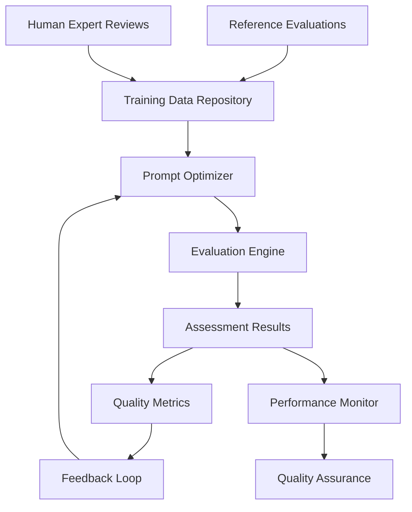

# Supervised Learning Framework for Prompt Optimization in Coding Assessments

## Executive Summary

This document presents a comprehensive supervised learning framework for optimizing prompts in coding assessments. The framework uses reference evaluations (like the Recess evaluation patterns) to continuously improve assessment accuracy and consistency through data-driven prompt optimization.

## 1. Framework Architecture

### 1.1 Core Components

```typescript
interface SupervisedLearningFramework {
  trainingDataRepository: TrainingDataRepository;
  promptOptimizer: PromptOptimizer;
  evaluationEngine: EvaluationEngine;
  feedbackLoop: FeedbackLoop;
  qualityAssurance: QualityAssurance;
  performanceMonitor: PerformanceMonitor;
}
```

### 1.2 System Overview



## 2. Training Data Structure and Format

### 2.1 Reference Evaluation Schema

```typescript
interface ReferenceEvaluation {
  id: string;
  metadata: {
    evaluator: string;
    timestamp: string;
    version: string;
    difficulty: 'junior' | 'mid' | 'senior' | 'lead' | 'architect';
    assessmentType: 'coding-challenge' | 'take-home' | 'live-coding' | 'code-review';
  };
  
  codeSubmission: {
    files: CodeFile[];
    language: string;
    framework?: string;
    totalLines: number;
    metrics: CodeMetrics;
  };
  
  assignment: {
    title: string;
    description: string;
    requirements: string[];
    constraints: string[];
    timeLimit?: number;
  };
  
  expertEvaluation: {
    overallScore: number;
    maxScore: number;
    passed: boolean;
    
    criteriaScores: {
      correctness: CriterionScore;
      codeQuality: CriterionScore;
      architecture: CriterionScore;
      performance: CriterionScore;
      testing: CriterionScore;
      security: CriterionScore;
    };
    
    qualitativeAssessment: {
      strengths: string[];
      weaknesses: string[];
      recommendations: string[];
      redFlags: string[];
    };
    
    developerProfile: {
      estimatedExperience: string;
      skillLevel: number; // 1-10
      aiAssistanceLevel: 'minimal' | 'low' | 'medium' | 'high';
      productionReadiness: 'ready' | 'not-ready' | 'requires-mentorship';
    };
  };
}

interface CriterionScore {
  score: number;
  maxScore: number;
  weight: number;
  justification: string;
  specificFindings: string[];
}

interface CodeMetrics {
  complexity: number;
  maintainability: number;
  testCoverage: number;
  securityScore: number;
  performanceScore: number;
}
```

### 2.2 Training Dataset Structure

```typescript
interface TrainingDataset {
  version: string;
  created: string;
  evaluations: ReferenceEvaluation[];
  metadata: {
    totalEvaluations: number;
    difficultyDistribution: Record<string, number>;
    languageDistribution: Record<string, number>;
    assessmentTypeDistribution: Record<string, number>;
  };
  
  qualityMetrics: {
    interRaterReliability: number;
    consistencyScore: number;
    coverageScore: number;
  };
}
```

### 2.3 Data Collection Pipeline

```typescript
class TrainingDataCollector {
  async collectFromExpertEvaluations(
    evaluations: ExpertEvaluation[]
  ): Promise<TrainingDataset> {
    const dataset: TrainingDataset = {
      version: this.generateVersion(),
      created: new Date().toISOString(),
      evaluations: [],
      metadata: this.initializeMetadata(),
      qualityMetrics: this.initializeQualityMetrics()
    };
    
    for (const evaluation of evaluations) {
      const structured = await this.structureEvaluation(evaluation);
      const validated = await this.validateEvaluation(structured);
      dataset.evaluations.push(validated);
    }
    
    return this.finalizeDataset(dataset);
  }
  
  private async structureEvaluation(
    evaluation: ExpertEvaluation
  ): Promise<ReferenceEvaluation> {
    // Extract code submission details
    const codeSubmission = await this.analyzeCodeSubmission(evaluation.code);
    
    // Parse expert assessment
    const expertEvaluation = await this.parseExpertAssessment(evaluation.assessment);
    
    return {
      id: this.generateId(),
      metadata: this.extractMetadata(evaluation),
      codeSubmission,
      assignment: this.parseAssignment(evaluation.assignment),
      expertEvaluation
    };
  }
}
```

## 3. Prompt Optimization Algorithms and Metrics

### 3.1 Multi-Objective Optimization

```typescript
interface OptimizationObjectives {
  accuracy: number;        // How close to expert scores
  consistency: number;     // Variance across similar submissions
  sensitivity: number;     // Ability to detect subtle differences
  specificity: number;     // Avoiding false positives
  efficiency: number;      // Token usage and speed
}

class MultiObjectiveOptimizer {
  async optimize(
    basePrompt: string,
    trainingData: TrainingDataset,
    objectives: OptimizationObjectives
  ): Promise<OptimizedPrompt> {
    const candidates = await this.generateCandidatePrompts(basePrompt);
    const evaluations = await this.evaluateCandidates(candidates, trainingData);
    
    return this.selectOptimalPrompt(evaluations, objectives);
  }
  
  private async generateCandidatePrompts(
    basePrompt: string
  ): Promise<PromptCandidate[]> {
    return [
      // Variation 1: Enhanced specificity
      await this.enhanceSpecificity(basePrompt),
      
      // Variation 2: Improved consistency
      await this.improveConsistency(basePrompt),
      
      // Variation 3: Better sensitivity
      await this.enhanceSensitivity(basePrompt),
      
      // Variation 4: Genetic algorithm variation
      await this.geneticVariation(basePrompt),
      
      // Variation 5: Reinforcement learning optimized
      await this.reinforcementOptimization(basePrompt)
    ];
  }
}
```

### 3.2 Quality Metrics Definition

```typescript
interface QualityMetrics {
  // Accuracy metrics
  scoreAccuracy: number;           // Mean absolute error from expert scores
  rankingAccuracy: number;         // Correlation with expert rankings
  passFailAccuracy: number;        // Binary classification accuracy
  
  // Consistency metrics
  intraClassConsistency: number;   // Variance within same difficulty level
  interRaterReliability: number;   // Agreement with multiple experts
  temporalConsistency: number;     // Stability over time
  
  // Coverage metrics
  criterionCoverage: number;       // Coverage of evaluation criteria
  edgeCaseDetection: number;       // Ability to identify edge cases
  biasDetection: number;           // Identification of potential biases
  
  // Efficiency metrics
  tokenEfficiency: number;         // Quality per token used
  responseTime: number;            // Average evaluation time
  costEfficiency: number;          // Quality per dollar spent
}

class QualityMetricsCalculator {
  async calculateMetrics(
    predictions: AssessmentResult[],
    references: ReferenceEvaluation[]
  ): Promise<QualityMetrics> {
    return {
      scoreAccuracy: this.calculateScoreAccuracy(predictions, references),
      rankingAccuracy: this.calculateRankingAccuracy(predictions, references),
      passFailAccuracy: this.calculatePassFailAccuracy(predictions, references),
      
      intraClassConsistency: this.calculateIntraClassConsistency(predictions),
      interRaterReliability: this.calculateInterRaterReliability(predictions, references),
      temporalConsistency: this.calculateTemporalConsistency(predictions),
      
      criterionCoverage: this.calculateCriterionCoverage(predictions, references),
      edgeCaseDetection: this.calculateEdgeCaseDetection(predictions, references),
      biasDetection: this.calculateBiasDetection(predictions, references),
      
      tokenEfficiency: this.calculateTokenEfficiency(predictions),
      responseTime: this.calculateResponseTime(predictions),
      costEfficiency: this.calculateCostEfficiency(predictions)
    };
  }
}
```

## 4. Validation and Testing Methodology

### 4.1 Cross-Validation Strategy

```typescript
class CrossValidationFramework {
  async performKFoldValidation(
    dataset: TrainingDataset,
    k: number = 5
  ): Promise<ValidationResults> {
    const folds = this.createStratifiedFolds(dataset, k);
    const results: FoldResult[] = [];
    
    for (let i = 0; i < k; i++) {
      const trainSet = this.createTrainingSet(folds, i);
      const testSet = folds[i];
      
      const optimizedPrompt = await this.trainPrompt(trainSet);
      const testResults = await this.evaluatePrompt(optimizedPrompt, testSet);
      
      results.push({
        fold: i,
        trainSize: trainSet.evaluations.length,
        testSize: testSet.evaluations.length,
        metrics: testResults.metrics,
        predictions: testResults.predictions
      });
    }
    
    return this.aggregateResults(results);
  }
  
  private createStratifiedFolds(
    dataset: TrainingDataset,
    k: number
  ): TrainingDataset[] {
    // Ensure balanced representation across difficulty levels,
    // languages, and assessment types
    const stratified = this.stratifyByAttributes(dataset, [
      'difficulty',
      'language',
      'assessmentType'
    ]);
    
    return this.splitIntoFolds(stratified, k);
  }
}
```

### 4.2 A/B Testing Framework

```typescript
class ABTestingFramework {
  async runPromptABTest(
    promptA: string,
    promptB: string,
    testSet: TrainingDataset,
    significance: number = 0.05
  ): Promise<ABTestResult> {
    const [resultsA, resultsB] = await Promise.all([
      this.evaluatePrompt(promptA, testSet),
      this.evaluatePrompt(promptB, testSet)
    ]);
    
    const statisticalTest = this.performStatisticalTest(resultsA, resultsB);
    
    return {
      promptA: {
        metrics: resultsA.metrics,
        sampleSize: resultsA.predictions.length
      },
      promptB: {
        metrics: resultsB.metrics,
        sampleSize: resultsB.predictions.length
      },
      statisticalSignificance: statisticalTest.pValue < significance,
      pValue: statisticalTest.pValue,
      confidenceInterval: statisticalTest.confidenceInterval,
      recommendation: this.generateRecommendation(statisticalTest)
    };
  }
}
```

### 4.3 Regression Testing

```typescript
class RegressionTestingSuite {
  async runRegressionTests(
    newPrompt: string,
    baselinePrompt: string,
    benchmarkDataset: TrainingDataset
  ): Promise<RegressionTestResults> {
    const [newResults, baselineResults] = await Promise.all([
      this.evaluatePrompt(newPrompt, benchmarkDataset),
      this.evaluatePrompt(baselinePrompt, benchmarkDataset)
    ]);
    
    return {
      performanceRegression: this.detectPerformanceRegression(newResults, baselineResults),
      qualityRegression: this.detectQualityRegression(newResults, baselineResults),
      newCapabilities: this.detectNewCapabilities(newResults, baselineResults),
      recommendations: this.generateRegressionRecommendations(newResults, baselineResults)
    };
  }
}
```

## 5. Integration with Coding-Test CLI Feature

### 5.1 CLI Integration Points

```typescript
interface CodingTestCLIIntegration {
  // Training mode
  trainPrompt(options: TrainingOptions): Promise<TrainingResult>;
  
  // Evaluation mode with learning
  evaluateWithLearning(options: EvaluationOptions): Promise<EvaluationResult>;
  
  // Feedback collection
  collectFeedback(result: EvaluationResult, expertReview: ExpertReview): Promise<void>;
  
  // Model comparison
  compareModels(options: ComparisonOptions): Promise<ComparisonResult>;
}

class CodingTestCLIHandler {
  async handleTrainingCommand(args: TrainingArgs): Promise<void> {
    const trainingData = await this.loadTrainingData(args.dataPath);
    const basePrompt = await this.loadPrompt(args.promptPath);
    
    const optimizer = new SupervisedLearningOptimizer();
    const optimizedPrompt = await optimizer.optimize(basePrompt, trainingData);
    
    await this.saveOptimizedPrompt(optimizedPrompt, args.outputPath);
    await this.generateTrainingReport(optimizer.getMetrics());
  }
  
  async handleEvaluationCommand(args: EvaluationArgs): Promise<void> {
    const prompt = await this.loadPrompt(args.promptPath);
    const submission = await this.loadSubmission(args.submissionPath);
    
    const evaluator = new SupervisedEvaluator(prompt);
    const result = await evaluator.evaluate(submission);
    
    // Collect feedback for continuous learning
    if (args.collectFeedback) {
      await this.collectFeedback(result, submission);
    }
    
    await this.outputResult(result, args.outputFormat);
  }
}
```

### 5.2 CLI Command Extensions

```bash
# Training commands
ai-code-review train-prompt \
  --training-data ./training-data.json \
  --base-prompt ./base-prompt.hbs \
  --output ./optimized-prompt.hbs \
  --validation-split 0.2 \
  --optimization-objectives accuracy:0.4,consistency:0.3,efficiency:0.3

# Evaluation with learning
ai-code-review --type coding-test ./submission \
  --prompt-version supervised-v1.2 \
  --collect-feedback \
  --expert-review ./expert-review.json \
  --learning-mode

# Model comparison
ai-code-review compare-prompts \
  --prompt-a ./prompt-v1.hbs \
  --prompt-b ./prompt-v2.hbs \
  --test-set ./test-evaluations.json \
  --metrics accuracy,consistency,efficiency

# Feedback collection
ai-code-review collect-feedback \
  --evaluation-result ./result.json \
  --expert-review ./expert-review.json \
  --update-training-data
```

## 6. Performance Monitoring and Quality Assurance

### 6.1 Real-time Performance Monitoring

```typescript
class PerformanceMonitor {
  private metrics: MetricsCollector;
  private alerts: AlertManager;
  
  async monitorEvaluation(
    result: EvaluationResult,
    reference?: ReferenceEvaluation
  ): Promise<void> {
    // Collect performance metrics
    await this.metrics.record({
      timestamp: new Date().toISOString(),
      accuracy: reference ? this.calculateAccuracy(result, reference) : undefined,
      responseTime: result.processingTime,
      tokenUsage: result.tokenCount,
      confidence: result.confidenceScore
    });
    
    // Check for anomalies
    const anomalies = await this.detectAnomalies(result);
    if (anomalies.length > 0) {
      await this.alerts.triggerAlert({
        type: 'anomaly',
        severity: 'medium',
        details: anomalies
      });
    }
    
    // Update model performance dashboard
    await this.updateDashboard(result);
  }
  
  async generatePerformanceReport(
    timeRange: TimeRange
  ): Promise<PerformanceReport> {
    const data = await this.metrics.query(timeRange);
    
    return {
      summary: this.calculateSummaryStats(data),
      trends: this.analyzeTrends(data),
      alerts: this.getAlerts(timeRange),
      recommendations: this.generateRecommendations(data)
    };
  }
}
```

### 6.2 Quality Assurance Framework

```typescript
class QualityAssuranceFramework {
  async performQualityChecks(
    prompt: string,
    evaluationResults: EvaluationResult[]
  ): Promise<QualityReport> {
    const checks = await Promise.all([
      this.checkConsistency(evaluationResults),
      this.checkBias(evaluationResults),
      this.checkCalibration(evaluationResults),
      this.checkRobustness(prompt, evaluationResults),
      this.checkFairness(evaluationResults)
    ]);
    
    return {
      overallScore: this.calculateOverallScore(checks),
      checks: checks,
      recommendations: this.generateQualityRecommendations(checks),
      riskAssessment: this.assessRisk(checks)
    };
  }
  
  private async checkConsistency(
    results: EvaluationResult[]
  ): Promise<QualityCheck> {
    const consistencyMetrics = this.calculateConsistencyMetrics(results);
    
    return {
      name: 'consistency',
      passed: consistencyMetrics.variance < this.thresholds.consistency,
      score: consistencyMetrics.score,
      details: consistencyMetrics.details,
      recommendations: this.getConsistencyRecommendations(consistencyMetrics)
    };
  }
}
```

## 7. Continuous Learning Engine

### 7.1 Incremental Learning Framework

```typescript
class IncrementalLearningEngine {
  private model: PromptModel;
  private memory: LearningMemory;
  
  async learn(
    newEvaluation: ReferenceEvaluation,
    currentPrompt: string
  ): Promise<PromptUpdate> {
    // Store new evaluation in memory
    await this.memory.store(newEvaluation);
    
    // Determine if update is needed
    const updateNeeded = await this.shouldUpdate(newEvaluation);
    
    if (updateNeeded) {
      // Generate prompt update
      const update = await this.generateUpdate(currentPrompt, newEvaluation);
      
      // Validate update
      const validation = await this.validateUpdate(update);
      
      if (validation.safe) {
        await this.applyUpdate(update);
        return update;
      }
    }
    
    return { type: 'no-update', reason: 'No significant improvement found' };
  }
  
  async batchLearning(
    evaluations: ReferenceEvaluation[],
    currentPrompt: string
  ): Promise<PromptUpdate> {
    // Batch process multiple evaluations
    const aggregatedLearning = await this.aggregateEvaluations(evaluations);
    
    // Generate comprehensive update
    const update = await this.generateBatchUpdate(currentPrompt, aggregatedLearning);
    
    // Extensive validation for batch updates
    const validation = await this.validateBatchUpdate(update);
    
    if (validation.safe) {
      await this.applyBatchUpdate(update);
      return update;
    }
    
    return { type: 'batch-rejected', reason: validation.reason };
  }
}
```

### 7.2 Adaptive Learning Strategies

```typescript
class AdaptiveLearningStrategy {
  async adaptToFeedback(
    feedback: TrainingFeedback[],
    currentPrompt: string
  ): Promise<AdaptationResult> {
    // Analyze feedback patterns
    const patterns = await this.analyzeFeedbackPatterns(feedback);
    
    // Determine adaptation strategy
    const strategy = await this.selectAdaptationStrategy(patterns);
    
    // Apply adaptation
    const adaptedPrompt = await this.applyAdaptation(currentPrompt, strategy);
    
    return {
      originalPrompt: currentPrompt,
      adaptedPrompt: adaptedPrompt,
      strategy: strategy,
      expectedImprovement: this.estimateImprovement(strategy, patterns)
    };
  }
  
  private async selectAdaptationStrategy(
    patterns: FeedbackPatterns
  ): Promise<AdaptationStrategy> {
    if (patterns.consistencyIssues) {
      return new ConsistencyImprovementStrategy();
    }
    
    if (patterns.accuracyIssues) {
      return new AccuracyImprovementStrategy();
    }
    
    if (patterns.biasIssues) {
      return new BiasReductionStrategy();
    }
    
    return new GeneralImprovementStrategy();
  }
}
```

## 8. Implementation Roadmap

### Phase 1: Foundation (Weeks 1-4)
- [ ] Implement training data schema and repository
- [ ] Create basic prompt optimization algorithms
- [ ] Develop quality metrics calculation framework
- [ ] Build initial CLI integration

### Phase 2: Core Learning (Weeks 5-8)
- [ ] Implement supervised learning optimizer
- [ ] Create cross-validation framework
- [ ] Build A/B testing capabilities
- [ ] Develop performance monitoring system

### Phase 3: Advanced Features (Weeks 9-12)
- [ ] Implement incremental learning engine
- [ ] Create adaptive learning strategies
- [ ] Build quality assurance framework
- [ ] Develop comprehensive reporting system

### Phase 4: Integration and Deployment (Weeks 13-16)
- [ ] Full CLI integration
- [ ] Production monitoring setup
- [ ] Documentation and training materials
- [ ] Performance optimization and scaling

## 9. Success Metrics and KPIs

### 9.1 Technical Metrics
- **Accuracy Improvement**: >15% reduction in MAE from expert scores
- **Consistency Score**: >0.85 inter-rater reliability
- **Processing Efficiency**: <30 seconds average evaluation time
- **Token Efficiency**: >20% reduction in token usage while maintaining quality

### 9.2 Business Metrics
- **Assessment Quality**: >90% expert approval rate
- **Time Savings**: >50% reduction in manual review time
- **Cost Efficiency**: >40% reduction in evaluation costs
- **User Satisfaction**: >4.5/5 user satisfaction score

### 9.3 Learning Metrics
- **Adaptation Speed**: <24 hours to incorporate new feedback
- **Stability**: <5% performance degradation over time
- **Coverage**: >95% of evaluation criteria consistently addressed
- **Bias Reduction**: <10% variance across demographic groups

## 10. Risk Mitigation

### 10.1 Technical Risks
- **Model Degradation**: Implement rollback mechanisms and A/B testing
- **Data Quality**: Validate all training data with multiple expert reviews
- **Overfitting**: Use cross-validation and regularization techniques
- **Scalability**: Design for distributed processing and caching

### 10.2 Operational Risks
- **Expert Availability**: Build diverse expert pool with redundancy
- **Feedback Quality**: Implement feedback validation and scoring
- **System Reliability**: Implement monitoring and alerting systems
- **Security**: Encrypt sensitive evaluation data and implement access controls

## 11. Conclusion

This supervised learning framework provides a comprehensive approach to optimizing coding assessment prompts through data-driven techniques. By leveraging reference evaluations and continuous learning, the system can maintain high accuracy and consistency while adapting to new patterns and requirements.

The framework's modular design allows for incremental implementation and continuous improvement, making it suitable for production deployment in coding assessment environments. The combination of multiple optimization techniques, robust validation, and comprehensive monitoring ensures reliable and trustworthy evaluation results.

---

*This framework builds upon the existing ai-code-review architecture and evaluation patterns, providing a systematic approach to prompt optimization that can significantly improve coding assessment quality and consistency.*